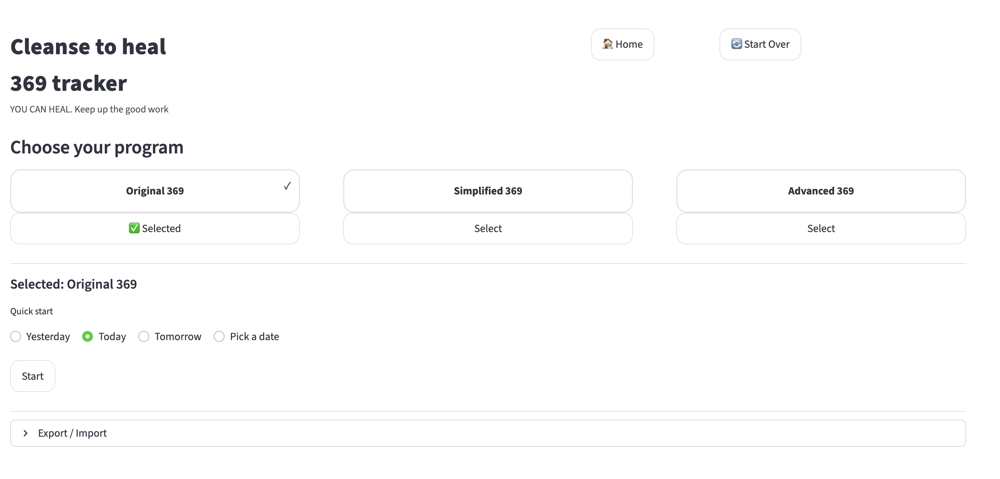
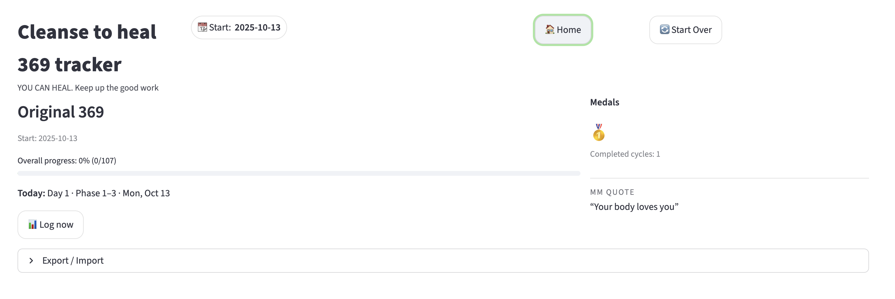
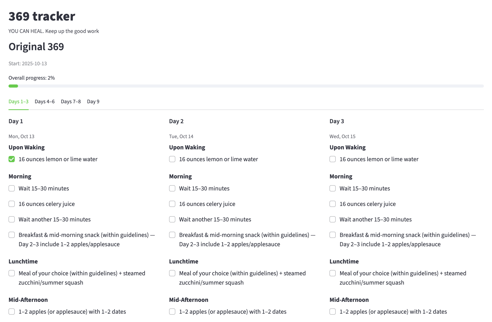

## 369 Cleanse Tracker

Click [here](https://mm369cleanse.streamlit.app/) to access the tracker. 
This app helps you track a 9-day cleanse routine inspired by the meal plans in [this book](https://books.google.com/books?id=k3EtzAEACAAJ&newbks=0&hl=en&source=newbks_fb).

It’s a simple companion for daily check-ins.
Disclaimer: For personal wellness tracking only—this is not medical advice or a substitute for professional care. This project is independent and not affiliated with the book’s author or publisher.

## Features
- Menu → Select a program: Original, Simplified, Advanced (text-only cards with smooth selection)
- Flexible start: Yesterday / Today / Tomorrow / custom date
- Smart Home: See today’s day number, current phase (1–3, 4–6, 7–8, 9), progress, medals, and a motivational quote
- Tracker: Clean grouped tabs (1–3, 4–6, 7–8, 9 with its own plan), interactive checkboxes
- Progress + medals: “Finish this program” awards a medal
- Import/Export: Save/restore progress as JSON (no database required)
- Future-ready: Supabase integration planned for cloud sync

## 📸 Screenshots

## Quick Start (developer)
### 1) Clone
git clone https://github.com/yliu668/mm-369-tracker.git
cd mm-369-tracker

### 2) Create a virtual env (recommended)
python -m venv .venv
source .venv/bin/activate   # Windows: .venv\Scripts\activate

### 3) Install
pip install -r requirements.txt
# (or) pip install streamlit

### 4) Run
streamlit run app.py
